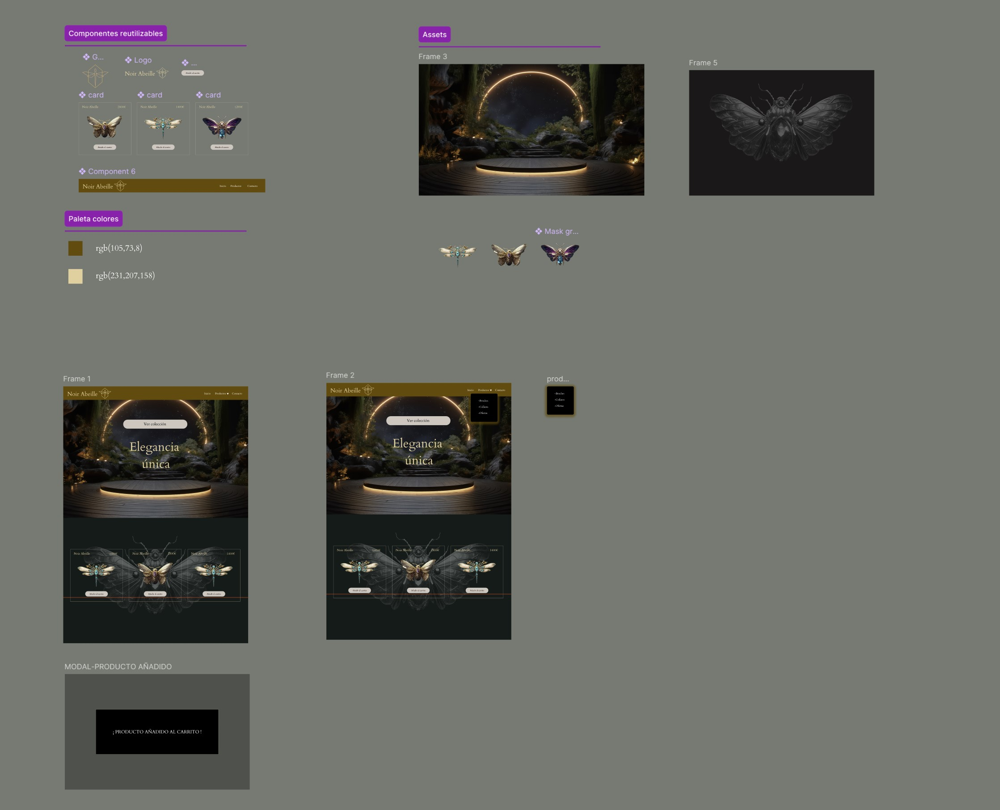
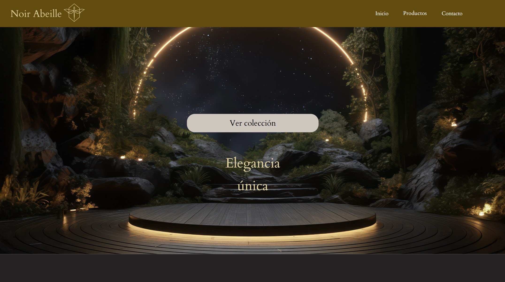
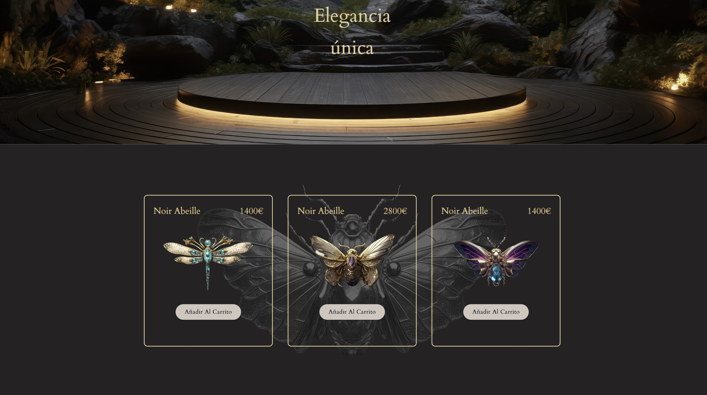

## 🐝 Proyecto Noir Abeille

Es la simulación de un proyecto de una elegante e-commerce de joyería de lujo basada en el simbolismo de las abejas .

## 🚀 Tecnologías utilizadas

- React (Vite como empaquetador)
- Material UI (MUI)
- CSS personalizado
- Figma (para el diseño del prototipo)

## 🎨 Proceso de Diseño

- Prototipo en Figma:
- Creación de componentes reutilizables (navbar, tarjetas de producto,botones y logo ).
- Animaciones Interactivas:para simular el proyecto final con Material UI (menú de productos y aparición de diálogo al añadir el producto a la cesta )

## 📚 Qué he aprendido

- Crear un prototipo en Figma para pasarlo a un diseño con código real .
- Uso de Material UI.En éste caso para crear un menú desplegable y cuadro de diálogo.
- Practicar con React la creación de componentes reutilizables como el navbar y las product Card .

## 📸 Capturas del proyecto

> _Captura prototipo Figma:_ >  > _Captura proyecto:_ >  > _Captura proyecto:_ > 

## 🚀 Cómo probar el proyecto

Clona este repositorio

```bash
git clone https://github.com/Anitasoyyo/Noirabeille.git
cd Noirabeille
```
